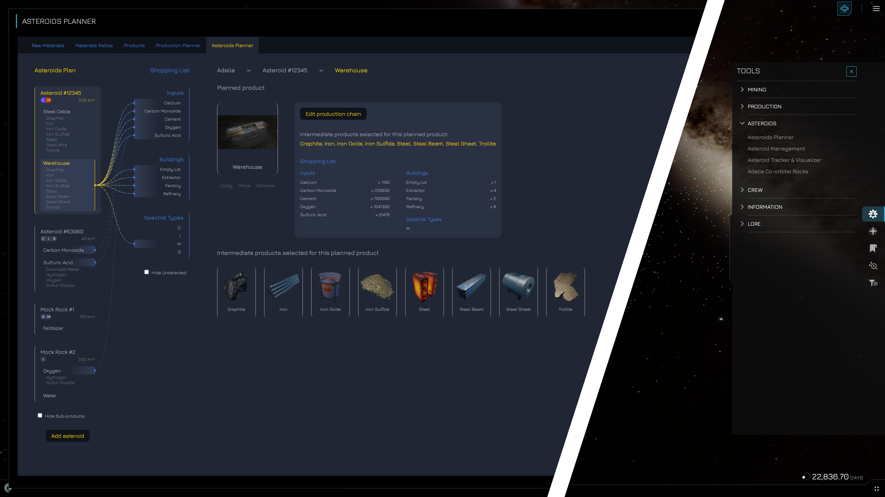

# Influence Tools - Chrome Extension

## About

**Discover and use community developed tools while playing Influence**

This Chrome extension will inject a "Community Tools" menu item into the Influence game client, with links to community developed tools and content, grouped into several categories: Mining, Production, Asteroids, Crew, Information, Lore, Games.



As of February 2024, this Chrome Extension works with the following versions of the Influence game client:
- "Limited Release" on Starknet mainnet - https://game.influenceth.io/
- "Pre-Release" on Starknet Sepolia - https://game-prerelease.influenceth.io/

## How to use

**Method 1 - recommended for most users:**

Simply install the extension from the Chrome Web Store, and enjoy automatic updates:
- https://chromewebstore.google.com/detail/influence-tools/kopdkjlnbfiegpdjiebogkakjfppfglj

**Method 2 - for developers and power users:**

This method allows you to change the extension's source code, but you will need to manually load it in your browser, every time you make changes, or when this respository is updated:
- Download this repository and unpack it (if downloaded as ZIP) into a dedicated folder on your computer. This will be your unpacked extension.
- Follow these instructions for loading an unpacked extension in your Chromium-based browser (Chrome, Brave etc.)
    - https://developer.chrome.com/docs/extensions/mv3/getstarted/development-basics/#load-unpacked

## Dev notes

If you are a developer or content creator looking to integrate your website into Influence via this Chrome extension, feel free to [contact me](https://twitter.com/elerium115), and please consider the following:

- Consider using the styling from my [Influence CSS](https://github.com/Elerium-115/influence-css) library, as a starting point for your website.
- Make sure that your website or hosted content can be displayed in an iframe. For example "medium.com" is blocking its content from being displayed in an iframe, so it is not currently supported by this Chrome extension.
- Test locally by adding your website details into `/globals/tools.js`, using the data structure in that file. You may also make a pull request with your changes.

**Features:**

UPDATE: The feature described below is NOT currently functional, as of November 2023.

- The asteroid ID (and type) / crew ID that's currently selected in-game (if any), is automatically injected in the iframe URL as a search-parameter, named `influence_asteroid` (and `influence_asteroid_type`) / `influence_crew`. This allows developers to pre-select stuff in their tool, if relevant to that asteroid / spectral type / crew:
    ```
    /**
    * Get asteroid ID injected from iframe parent, if any
    * e.g. game URL: https://game.influenceth.io/asteroids/104
    * => iframe URL: https://adalia.stuff/tool.html?influence_asteroid=104&influence_asteroid_type=CMS
    */
    const urlParams = new URLSearchParams(location.search);
    const influenceAsteroidId = urlParams.get('influence_asteroid');
    const influenceAsteroidType = urlParams.get('influence_asteroid_type');
    if (influenceAsteroidId) {
        // Pre-select stuff for this asteroid ID ...
    }
    if (influenceAsteroidType) {
        // Pre-select stuff for this asteroid type ...
    }
    ```

---

Created by [@elerium115](https://twitter.com/elerium115) for the space strategy sandbox MMO [Influence](https://www.influenceth.io/).
